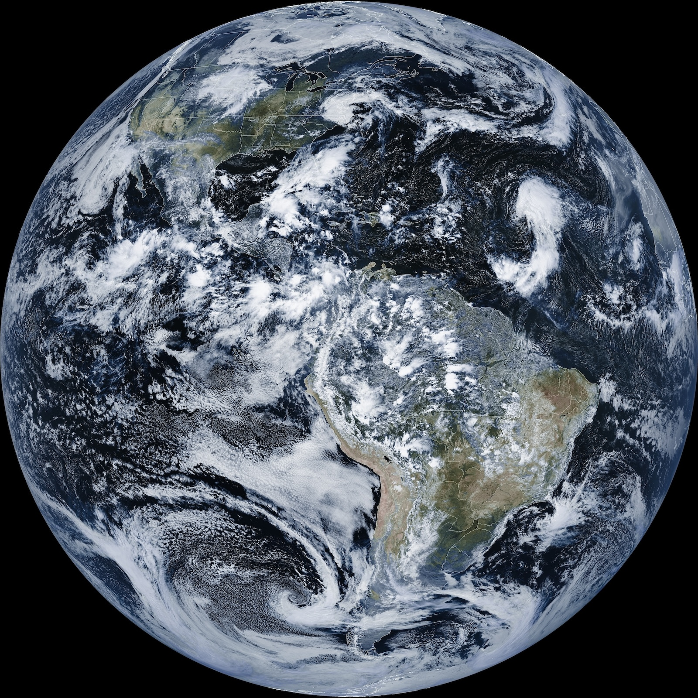
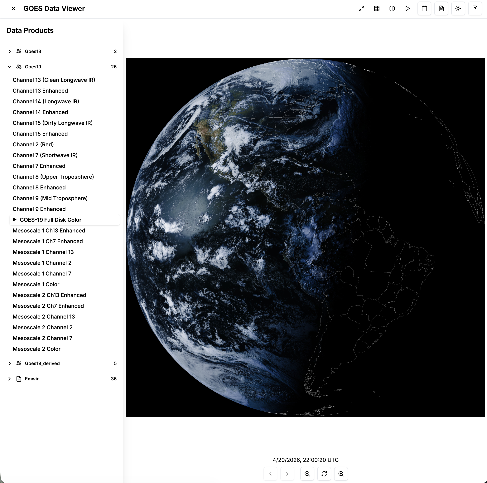
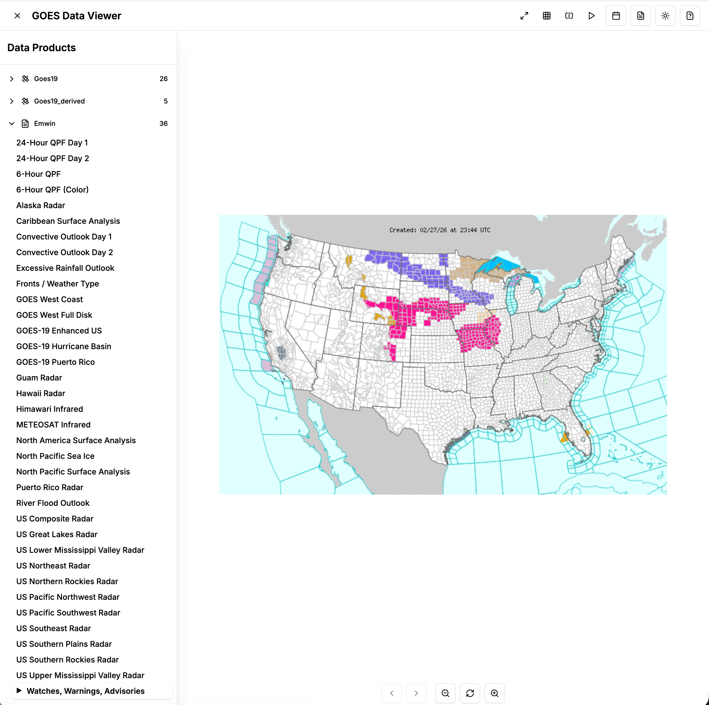
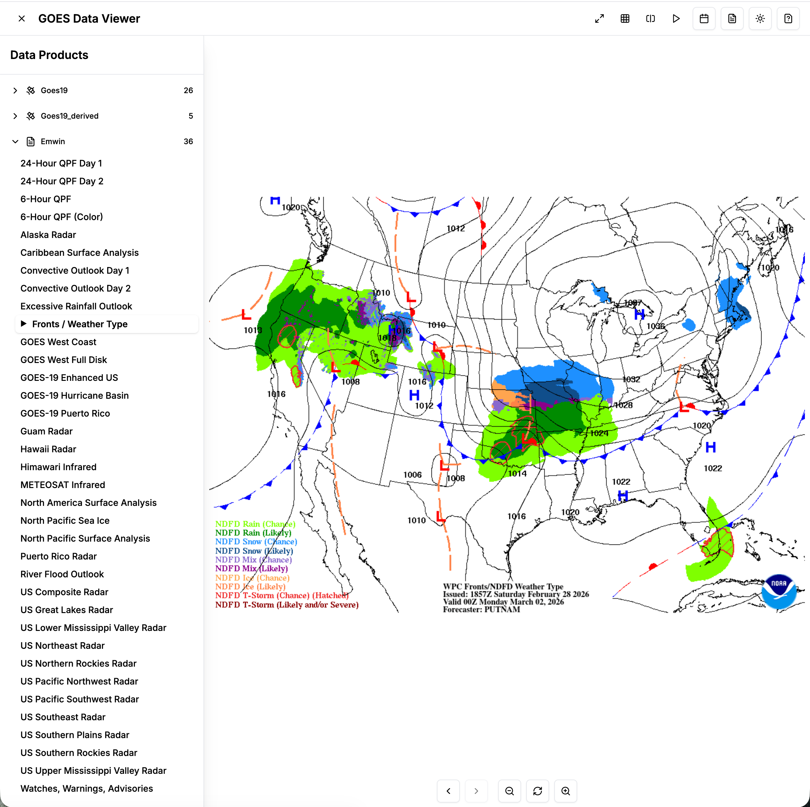

# GOES-stack

A modern, containerized solution for processing, storing, and viewing [GOES satellite imagery + data](https://www.ncei.noaa.gov/products/satellite/goes-r) on a long-running basis. Building on [satdump](https://www.satdump.org/), [goesproc](https://pietern.github.io/goestools/commands/goesproc.html), [RustFS](https://rustfs.com/), docker compose, and Go.

This monorepo contains all components needed to run a complete GOES satellite ground station indefinitely.



*Full disk color image pulled from GOES-19 on September 17, 2025*

## What you get

Once the stack is running, you'll be able to see:

- **GOES-19 (and/or GOES-18) imagery** — full disk and mesoscale regions, refreshed every ~10–15 minutes:
  - Visible (Channel 2), shortwave IR (Channel 7), water vapor (Channels 8 and 9), longwave IR (Channels 13–15)
  - False-color composites for full disk and mesoscale regions
  - RGB-enhanced versions of each IR/water-vapor channel using McIDAS-style color gradients
- **GOES-19 Level 2 derived products** — sea-surface temperature, land-surface temperature, derived stability index (CAPE), total precipitable water, rainfall rate (RRQPE), and cloud-top height
- **Himawari-9 relay imagery** — full disk shots relayed via GOES, useful for the western Pacific
- **EMWIN weather products** — radar mosaics, surface analyses, frontal charts, QPF, hurricane and convective outlooks, watches/warnings, and the full firehose of NWS text bulletins
- **NWS imagery and text** — synoptic charts and regional forecasts as they're broadcast

All of this is broadcast directly from the satellite, so the stack keeps working even if your upstream internet goes down — as long as the dish has line of sight, you keep getting data.

## Why not just run satdump itself?
While you can run tools like [satdump](https://www.satdump.org/) alone on a laptop to directly view data from GOES satellites via the desktop app, I wanted to take a different approach. The typical `satdump` setup with a laptop attached to a dish is fun for an afternoon. `goes-stack` is meant to be run indefinitely, quietly collecting weather data from space at your home, and makes that data accessible from a web interface. While `goes-stack` does use `satdump` in CLI mode, by compartmentalizing the system into separate pieces, we split the computing load, and thus make it easier to run the Raspberry Pi outdoors indefinitely on 12V solar power to collect the data.

## Architecture Overview

```
Raspberry Pi (Yard) → Processing Server → RustFS Storage → Web Frontend
    ↓                      ↓                  ↓               ↓
  satdump/goesrecv    →  goesproc-docker  →  goes-api-go   →  goes-viewer
```

### Recommended hardware
- A Raspberry Pi (ideally 4b, as it has enough processing power + less power draw than a 5) to put in a weatherproof enclosure
- [Nooelec NESDR SMArTee XDR SDR](https://www.nooelec.com/store/sdr/sdr-receivers/smart/nesdr-smartee-xtr-sdr.html)
  - other SDRS will work, but this one is very easy to get a good signal out of for GOES
- [Discovery Dish + L-Band Satellite Feed](https://www.crowdsupply.com/krakenrf/discovery-dish)
  - For aiming your dish, see tools like [https://www.dishpointer.com/](https://www.dishpointer.com/). Use GOES-19 on the east coast and GOES-18 for the west coast of the US.
- [Renogy Rover 20A MPPT Solar Charger](https://www.renogy.com/products/rover-li-20-amp-mppt-solar-charge-controller)
- 2x100 watt solar panels of your choice, plus appropriate mounting hardware
- Suitable 12v LifePO4 battery (at least 20Ah, would suggest getting two for extra runtime during cloudy days)
- A modern desktop/server inside (connected to the same network as the pi, via wifi or ethernet) with at least a 1TB SSD for the RustFS bucket — `goes-stack` is designed to run indefinitely and the archive grows continuously (full-disk imagery alone is ~100MB/day per channel, and EMWIN piles on text + maps on top of that). 1TB will give you many months of headroom; plan a retention/cleanup policy before it fills up.
- Internet connection (you can expose the frontend with something like Cloudflare tunnel).
- You'll need all the appropriate wires, connectors etc for building the 12V electrical system out too. Not going to go into all those details here, but high level recommendations:
  - [Good buck converters](https://www.amazon.com/dp/B07XXWQ49N)
  - [Decent USB-A to USB-C cables](https://www.amazon.com/dp/B08PXWYKTB)
  - [12V fuse block](https://www.amazon.com/dp/B096Z1WNLW)
  - [Outdoor enclosure for Raspberry Pi + SDR, fuse block, buck converters](https://www.amazon.com/dp/B08ZRR2DJX)
  - [Battery boxes](https://www.amazon.com/dp/B0CSTDNC2F)

### Recommended software for running on the pi in the yard
[goesrecv](https://github.com/pietern/goestools) and [satdump](https://github.com/SatDump/SatDump) work equally well, but I'm using [satdump](https://www.satdump.org/).


## Prerequisite hardware setup
1. Assemble the dish, mounting it in your yard where you can get clear line-of-sight on the appropriate GOES satellite for your region.
2. Assemble the 12V electrical system (batteries, solar charge controller, solar panels, fuse block, buck converters) with a suitable weatherproof enclosure for the batteries and equipment.
3. Aim the dish. I would recommend using a laptop for initial alignment [using the satdump GUI](https://usradioguy.com/goes-receiving-in-windows-for-satdump/). You want to see a SNR of 6.0dB or higher, and two nice clusters of dots in the BPSK demodulator. Once you have the alignment dialed in, tighten the dish mount. 
4. Connect the SDR to the Pi, install in the enclosure, and [setup satdump CLI on it](https://usradioguy.com/receiving-goes-hrit-with-satdump/). 

With satdump, you'd then run something like and ensure it's getting the right signal:

```bash
satdump live goes_hrit_tcp GOES_19 \
  --source rtlsdr --samplerate 2.4e6 --frequency 1694.1e6 \
  --agc --bias --fill_missing \
  --http_server 0.0.0.0:8080
```

`--http_server 0.0.0.0:8080` exposes a `/api` healthcheck API endpoint reporting SNR etc. The `goes_hrit_tcp` pipeline also publishes the demodulated stream over TCP on port 5004 by default — `goesproc-docker` (running on your indoor server) connects out to the Pi at `<pi-ip>:5004` to consume it (see the `--subscribe tcp://<pi-ip>:5004` argument in `goesproc-docker/docker-compose.yml`).

To keep satdump running on the Pi across reboots, drop in the systemd unit at [`goesrecv/satdump-goes19.service`](goesrecv/satdump-goes19.service) — install steps are in [`goesrecv/README.md`](goesrecv/README.md).

## Components

### rustfs
S3-compatible file storage for the processed satellite data, powered by [RustFS](https://rustfs.com/) (a high-performance Rust-based MinIO alternative). See [rustfs/](rustfs/).

### 🐳 goesproc-docker
Containerized goesproc setup that processes the raw GOES TCP stream from the Pi into images and weather products, then uploads to RustFS. See [goesproc-docker/](goesproc-docker/).

**Features:**
- Processes raw GOES data from satdump/goesrecv TCP streams
- Automatic image upload to RustFS every 15 minutes via sidecar container
- Local cleanup of successfully uploaded files
- Comprehensive logging and error handling
- Environment-based configuration
- Watchdog sidecar container to automatically restart goesproc whenever the Raspberry Pi restarts

### 🔧 goes-api-go
Lightweight Go API server that provides RESTful endpoints for accessing satellite images stored in any S3-compatible storage (RustFS, MinIO, AWS S3, etc.). See [goes-api-go/](goes-api-go/).

**Endpoints:**
- `/latest` - Get the most recent satellite image
- `/archive/:date` - Get images for a specific date
- `/available-dates` - List all dates with available imagery
- `/proxy/image` - Secure image proxy with URL validation

### 🛰️ goes-viewer
Modern Next.js 15 frontend for viewing GOES satellite imagery with a clean, responsive interface. See [goes-viewer/](goes-viewer/).

**Features:**
- Latest image viewer with automatic refresh
- Image archive with date picker
- Modern UI built with Shadcn/UI and Radix primitives
- TypeScript for type safety
- Dark/light theme support
- Proxying for loading images from goes-api-go. By proxying the images, it is possible to just expose goes-viewer behind a [Cloudflare Tunnel](https://developers.cloudflare.com/cloudflare-one/networks/connectors/cloudflare-tunnel/) to share your site with the web.

| GOES-19 full disk | EMWIN weather product | EMWIN surface analysis |
| --- | --- | --- |
|  |  |  |


## Quick Start

### 1. Set up RustFS Storage

```bash
cd rustfs
docker-compose up -d
```

This creates an S3-compatible storage backend at `http://localhost:9000`. Visit the RustFS console at `http://localhost:9001`, create a bucket named `goes-data`, and generate an access key pair for the next steps.

> A one-shot `rustfs-init` container runs first to chown `./data/` to the in-container `rustfs` UID (10001) so the bind mount is writable. If RustFS ever changes its container UID, update the chown target in [`rustfs/docker-compose.yml`](rustfs/docker-compose.yml).

### 2. Start goesproc Processing with Auto-Upload

Create `goesproc-docker/docker-compose.override.yml` with your S3 endpoint and credentials:

```yaml
services:
  uploader:
    environment:
      - S3_ENDPOINT=rustfs.local:9000
      - S3_ACCESS_KEY=example
      - S3_SECRET_KEY=example-secret
      - BUCKET_NAME=goes-data
      - UPLOAD_INTERVAL=900            # 15 minutes in seconds
```

Then update `docker-compose.yml` to point to your Pi's IP for the TCP stream and start the stack:

```bash
cd goesproc-docker
docker-compose up -d
```

The uploader sidecar will automatically upload processed images to RustFS every 15 minutes, clean up local files after successful upload, and log to `./logs/upload.log`.

### 3. Start the API Server

```bash
cd goes-api-go
cp docker-compose.example.yml docker-compose.override.yml
# Edit docker-compose.override.yml with your S3 credentials
docker-compose up -d
```

### 4. Start the Web Frontend

```bash
cd goes-viewer
npm install
npm run dev
```

Visit `http://localhost:3000` to view your satellite imagery (or `http://localhost:3009` if running via the provided `docker-compose.yml`).

## Configuration Reference

### Environment Variables

**goes-api-go:**
```bash
S3_ENDPOINT=localhost:9000
ACCESS_KEY_ID=rustfsadmin
SECRET_ACCESS_KEY=rustfsadmin
BUCKET_NAME=goes-data
USE_SSL_FOR_S3=false
PORT=3000
```

**goesproc-docker:**
```bash
S3_ENDPOINT=localhost:9000
S3_ACCESS_KEY=rustfsadmin
S3_SECRET_KEY=rustfsadmin
S3_USE_SSL=false
BUCKET_NAME=goes-data
UPLOAD_INTERVAL=900  # 15 minutes
```

### goesproc Processing Pipeline

Edit `goesproc-docker/config/goesproc.conf` to customize what products get extracted from the stream.

## Development

### goes-viewer (Next.js)
```bash
cd goes-viewer
npm run dev          # Development server with hot reload
npm run build        # Production build
npm run lint         # ESLint checking
```

### goes-api-go
```bash
cd goes-api-go
go run main.go       # Development server
make build          # Build binary
make test           # Run tests
```

## Deployment

Each component can be deployed independently using Docker:

```bash
# API Server
cd goes-api-go && docker-compose up -d

# Frontend (build and serve)
cd goes-viewer && docker build -t goes-viewer . && docker run -p 3000:3000 goes-viewer

# Processing
cd goesproc-docker && docker-compose up -d
```

## Troubleshooting

### Upload Issues
- Check S3 connectivity: `docker-compose exec uploader aws --endpoint-url http://$S3_ENDPOINT s3 ls`
- View upload logs: `docker-compose logs -f uploader`
- Verify bucket permissions in the RustFS console

### Processing Issues
- Check TCP connection to Raspberry Pi
- Verify goesproc configuration file
- Monitor processing logs: `docker-compose logs -f goesproc`

## Contributing

This is a personal project, but contributions are welcome! Please open issues or pull requests.

## License

MIT License.
